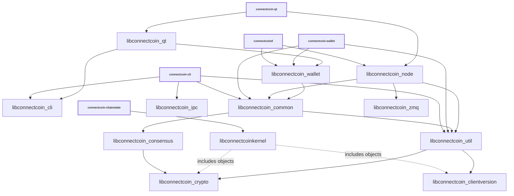

# Libraries

ConnectCoin executables and internal CMake targets use ConnectCoin branding.
Some inherited C++ namespaces and source filenames remain unchanged when they
are implementation details. The experimental external `libconnectcoinkernel`
API is a ConnectCoin-native, ABI-incompatible fork of the upstream API.

| Name                         | Description |
|------------------------------|-------------|
| *libconnectcoin_cli*         | RPC client functionality used by *connectcoin-cli* executable |
| *libconnectcoin_clientversion* | Build and version information shared by other targets. |
| *libconnectcoin_common*      | Home for common functionality shared by different executables and libraries. Similar to *libconnectcoin_util*, but higher-level (see [Dependencies](#dependencies)). |
| *libconnectcoin_consensus*   | Consensus functionality used by *libconnectcoin_node* and *libconnectcoin_wallet*. |
| *libconnectcoin_crypto*      | Hardware-optimized functions for data encryption, hashing, message authentication, and key derivation. |
| *libconnectcoinkernel*       | Optional experimental consensus engine for external consumers, built with `BUILD_KERNEL_LIB`. |
| *libconnectcoin_qt*          | GUI functionality used by *connectcoin-qt* and *connectcoin-gui* executables. |
| *libconnectcoin_ipc*         | IPC functionality used by *connectcoin-node* and *connectcoin-gui* executables when [`-DENABLE_IPC=ON`](multiprocess.md) is used. |
| *libconnectcoin_node*        | P2P and RPC server functionality used by *connectcoind* and *connectcoin-qt* executables. |
| *libconnectcoin_util*        | Lower-level common functionality shared by other libraries (see [Dependencies](#dependencies)). |
| *libconnectcoin_wallet*      | Wallet functionality used by *connectcoind* and *connectcoin-wallet* executables. |
| *libconnectcoin_zmq*         | [ZeroMQ](../zmq.md) functionality used by *connectcoind* and *connectcoin-qt* executables. |

## Conventions

- Most libraries are internal and have completely unstable APIs. There are few
  or no restrictions on backwards compatibility or external dependencies. The
  experimental *libconnectcoinkernel* API is public but not yet stable.

- Generally each library should have a corresponding source directory and
  namespace. Source organization remains a work in progress, so namespaces are
  not yet fully rebranded. CMake target declarations use
  [`add_library(connectcoin_* ...)`](../../src/CMakeLists.txt). Examples:

  - *libconnectcoin_node* code lives in `src/node/` in the `node::` namespace
  - *libconnectcoin_wallet* code lives in `src/wallet/` in the `wallet::` namespace
  - *libconnectcoin_ipc* code lives in `src/ipc/` in the `ipc::` namespace
  - *libconnectcoin_util* code lives in `src/util/` in the `util::` namespace
  - *libconnectcoin_consensus* code lives in `src/consensus/` in the `Consensus::` namespace

## Dependencies

The graph below shows direct CMake link dependencies among selected ConnectCoin
targets, plus the kernel's object inclusion dependencies. It is not a complete
symbol-level dependency graph. Conditional wallet and ZeroMQ edges apply only
when those components are enabled; the kernel and chainstate utility are also
optional. Other executables, tests, interface targets, and third-party libraries
are omitted.

<table><tr><td>

</td></tr><tr><td>

**Selected build dependencies**. Solid arrows are direct links; dotted arrows
include object files. The declarations in [`src/CMakeLists.txt`](../../src/CMakeLists.txt)
and the component CMake files are authoritative.

</td></tr></table>

- Libraries should minimize dependencies. Node and wallet implementations
  communicate through abstract classes in [`src/interfaces/`](../../src/interfaces/)
  rather than introducing circular library dependencies.

- *libconnectcoin_crypto* should be standalone and not depend on other project libraries.

- Among project libraries, *libconnectcoin_consensus* links to
  *libconnectcoin_crypto*. It also uses third-party cryptographic libraries.

- *libconnectcoin_util* links to *libconnectcoin_crypto* and
  *libconnectcoin_clientversion*. It should contain low-level functionality
  suitable for internal and kernel consumers.

- *libconnectcoin_common* links to *libconnectcoin_util* and
  *libconnectcoin_consensus*, with *libconnectcoin_crypto* available transitively.

- *connectcoin-wallet* compiles `wallet/wallettool.cpp` directly; there is no
  separate *libconnectcoin_wallet_tool* target.

- *libconnectcoinkernel* compiles its own set of consensus, validation, and util
  sources and includes crypto and version objects. It does not link the
  *libconnectcoin_consensus* or *libconnectcoin_util* targets. Its other
  dependencies include RandomX, Mbed TLS, secp256k1, and LevelDB; see
  [`src/kernel/CMakeLists.txt`](../../src/kernel/CMakeLists.txt).

- *libconnectcoin_node* compiles validation code directly and does not link
  *libconnectcoinkernel*. The optional *connectcoin-chainstate* executable is a
  consumer of the external kernel API.

## Work in progress

- The kernel boundary remains experimental. The inherited upstream
  [libbitcoinkernel project](https://github.com/bitcoin/bitcoin/issues/27587)
  provides architectural background, not a description of the current
  ConnectCoin node's link dependencies.
