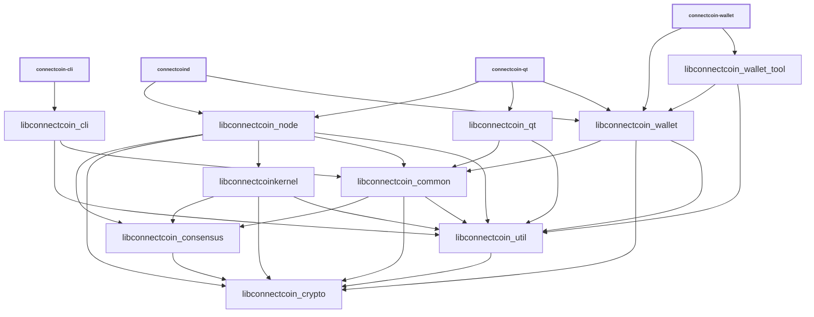

# Libraries

ConnectCoin executables and internal CMake targets use ConnectCoin branding.
Some inherited C++ namespaces and source filenames remain unchanged when they
are implementation details. The experimental external `libconnectcoinkernel`
API is a ConnectCoin-native, ABI-incompatible fork of the upstream API.

| Name                         | Description |
|------------------------------|-------------|
| *libconnectcoin_cli*         | RPC client functionality used by *connectcoin-cli* executable |
| *libconnectcoin_common*      | Home for common functionality shared by different executables and libraries. Similar to *libconnectcoin_util*, but higher-level (see [Dependencies](#dependencies)). |
| *libconnectcoin_consensus*   | Consensus functionality used by *libconnectcoin_node* and *libconnectcoin_wallet*. |
| *libconnectcoin_crypto*      | Hardware-optimized functions for data encryption, hashing, message authentication, and key derivation. |
| *libconnectcoinkernel*       | Experimental ConnectCoin consensus engine used for validation. |
| *libconnectcoin_qt*          | GUI functionality used by *connectcoin-qt* and *connectcoin-gui* executables. |
| *libconnectcoin_ipc*         | IPC functionality used by *connectcoin-node* and *connectcoin-gui* executables when [`-DENABLE_IPC=ON`](multiprocess.md) is used. |
| *libconnectcoin_node*        | P2P and RPC server functionality used by *connectcoind* and *connectcoin-qt* executables. |
| *libconnectcoin_util*        | Lower-level common functionality shared by other libraries (see [Dependencies](#dependencies)). |
| *libconnectcoin_wallet*      | Wallet functionality used by *connectcoind* and *connectcoin-wallet* executables. |
| *libconnectcoin_wallet_tool* | Lower-level wallet functionality used by *connectcoin-wallet* executable. |
| *libconnectcoin_zmq*         | [ZeroMQ](../zmq.md) functionality used by *connectcoind* and *connectcoin-qt* executables. |

## Conventions

- Most libraries are internal and have completely unstable APIs. There are few
  or no restrictions on backwards compatibility or external dependencies. The
  experimental *libconnectcoinkernel* API is public but not yet stable.

- Generally each library should have a corresponding source directory and
  namespace. Source organization remains a work in progress, so namespaces are
  not yet fully rebranded. CMake target declarations use
  [`add_library(connectcoin_* ...)`](../../src/CMakeLists.txt). Examples:

  - *libconnectcoin_node* code lives in `src/node/` in the `node::` namespace
  - *libconnectcoin_wallet* code lives in `src/wallet/` in the `wallet::` namespace
  - *libconnectcoin_ipc* code lives in `src/ipc/` in the `ipc::` namespace
  - *libconnectcoin_util* code lives in `src/util/` in the `util::` namespace
  - *libconnectcoin_consensus* code lives in `src/consensus/` in the `Consensus::` namespace

## Dependencies

- Libraries should minimize dependencies and only reference symbols following
  the arrows shown below:

<table><tr><td>

</td></tr><tr><td>

**Dependency graph**. Arrows show linker symbol dependencies. *Crypto* depends
on nothing. *Util* is used throughout the project. *libconnectcoinkernel* depends
only on consensus, crypto, and util.

</td></tr></table>

- The graph shows direct linker-symbol dependencies, not indirect calls through
  interfaces. Wallet and node implementations communicate through abstract
  classes in [`src/interfaces/`](../../src/interfaces/), avoiding direct or
  circular library dependencies.

- *libconnectcoin_crypto* should be standalone and not depend on other project libraries.

- *libconnectcoin_consensus* should only depend on *libconnectcoin_crypto*.

- *libconnectcoin_util* should depend only on *libconnectcoin_crypto* and should
  contain low-level functionality suitable for internal and kernel consumers.

- *libconnectcoin_common* should only depend on *libconnectcoin_util*,
  *libconnectcoin_consensus*, and *libconnectcoin_crypto*.

- *libconnectcoinkernel* should only depend on *libconnectcoin_util*,
  *libconnectcoin_consensus*, and *libconnectcoin_crypto*.

- Only *libconnectcoin_node* should depend directly on *libconnectcoinkernel*.
  GUI and wallet libraries should use the consensus, common, crypto, and util
  libraries for scripting and signing functionality.

- GUI, node, and wallet implementations should remain independent and interact
  only through abstract interfaces in [`src/interfaces/`](../../src/interfaces/).

## Work in progress

- Validation code continues moving from *libconnectcoin_node* to
  *libconnectcoinkernel*, following the architecture of the inherited upstream
  [libbitcoinkernel project](https://github.com/bitcoin/bitcoin/issues/27587).
